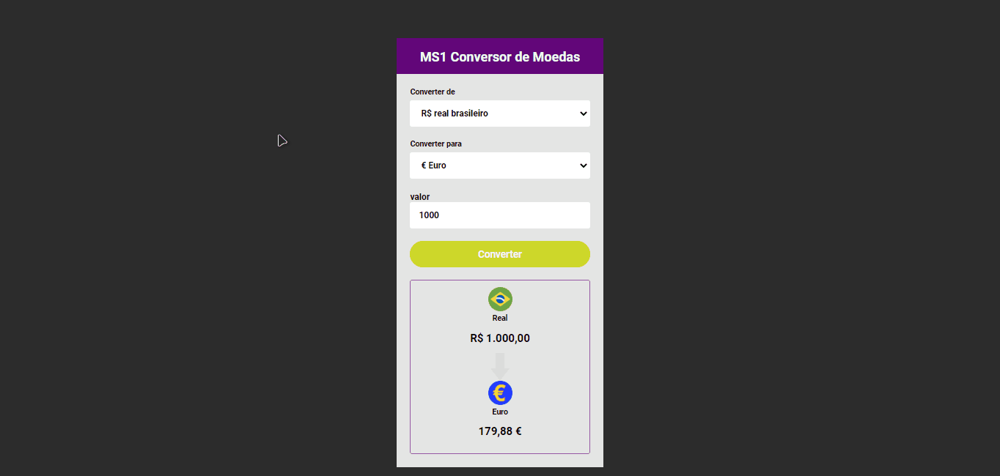

<h1 align="center">
  💻 Currency converter 💻
</h1>

<h4 align="center">
  💻 Currency Converter that updates currency values automatically!!! 💻
</h4>

## Photo 🎴
   

   
  
   

   
   <a href="#On">On</a> .
   <a href="#Roadmap">Roadmap</a> .
   <a href="#Technologies">Technologies</a> .
   <a href="#Photo">Photo</a> . 
   <a href="#Author">Author</a> 
   
 

   
 ## On ✔
     
     
   
 Currency conversion project, which can be used at any time as it updates currencies automatically!

   
   
 ## Roadmap 🗺
   
   
 This was my first project with Java Script and it was extremely important because it put me to the test in a lot of things! 

   
  ## Technologies 🚀
   
   <h3 align="center"> Technologies used in the project 🙃 </h3>
   
   
   
- [HTML](https://www.w3schools.com/html/)
- [CSS](https://www.w3schools.com/css/)
- [JavaScript](https://www.javascript.com/)

 
 

   
## Author 🙋🏾‍♂️
   
 Hello, my name is João.   Follow me on <a href="https://www.linkedin.com/in/joaosoaressilva/" target="_blank">Linkedin</a> to see more about the projects I post.!

## License 📝

This project is under the [MIT license](./LICENSE).
